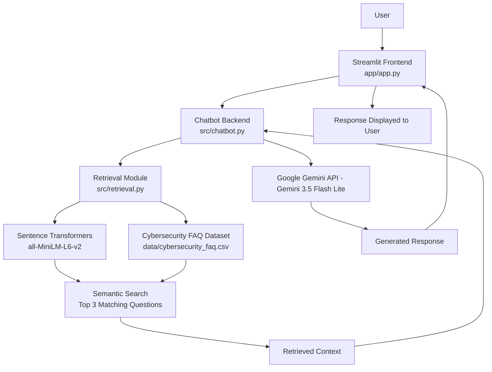

# System Architecture Diagram

```mermaid
flowchart TD
    A[User] --> B[Streamlit Frontend<br/>app/app.py]
    B --> C[Chatbot Backend<br/>src/chatbot.py]
    C --> D[Retrieval Module<br/>src/retrieval.py]

    D --> E[Cybersecurity FAQ Dataset<br/>data/cybersecurity_faq.csv]
    D --> F[Sentence Transformers<br/>all-MiniLM-L6-v2]
    F --> G[Semantic Search<br/>Top 3 Matching Questions]

    E --> G
    G --> H[Retrieved Context]
    H --> C

    C --> I[Google Gemini API - Gemini 3.5 Flash Lite]
    I --> J[Generated Response]
    J --> B
    B --> K[Response Displayed to User]
```
